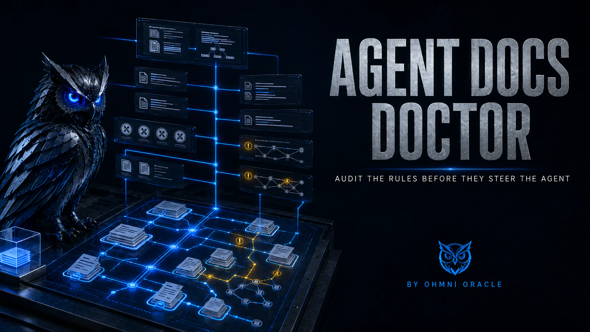

# Agent Docs Doctor

<p align="center">
  
</p>

<p align="center">
  <a href="https://github.com/BTCElectrician/agent-docs-doctor/actions/workflows/ci.yml"></a>
  <a href="https://opensource.org/licenses/Apache-2.0"></a>
  
  
</p>

<p align="center"><strong>Find the stale, conflicting, duplicated, and competing instructions steering your coding agents.</strong></p>

Agent Docs Doctor checks the instructions and status documents that steer Codex, Claude Code,
Cursor, and similar tools. It explains what it found in plain English, recommends what to fix, and
calls out what may be safer to leave alone until someone confirms the intent.

The audit runs locally, requires no API key, and does not change the repository. Until an immutable
release artifact is published, the safe first run is from a checkout whose commit you have
reviewed:

```bash
git clone https://github.com/BTCElectrician/agent-docs-doctor.git
cd agent-docs-doctor
git rev-parse HEAD
git status --short
python3 -B scripts/agent_docs_doctor.py audit fixtures/healthy-repo --format text
```

Compare the displayed commit with the commit you intended to review before running the code against
another repository. There is intentionally no one-line command that downloads a mutable branch and
executes it immediately.

> **Audit safety boundary:** `audit` and `inventory` never delete, rewrite, move, archive, create,
> chmod, or “fix” files in the target repository. Text audit output states `Nothing was changed.`
> The separately invoked skill installer can mutate only its selected user-level skill location
> after a fingerprint-bound preview and explicit apply.

## TL;DR

**The problem:** Coding agents increasingly read repository instructions carefully. When an old
plan, forgotten adapter, duplicated rule, or competing status file remains discoverable, that
extra context can steer the agent away from current reality.

**The solution:** Agent Docs Doctor reconstructs the instruction surfaces first. It reports what
exists, how it may load, what overlaps, which references are broken, and where current-state claims
compete—without pretending it can infer organizational intent from a filename.

### Why use Agent Docs Doctor?

| Capability | What you get |
| --- | --- |
| **Evidence before opinion** | Relative paths, hashes, byte counts, loading classifications, references, and exact overlap |
| **Human-sized decisions** | Stable choices such as **Keep**, **Fix**, **Clarify**, **Combine**, **Archive later**, or **Ask an owner** |
| **Read-only audit path** | Audits do not mutate the target repository; previews propose operations without applying them |
| **Platform-aware discovery** | Recognizes Codex, Claude Code, Cursor, Agent Skills, and common status/handoff surfaces |
| **Privacy-minimized output** | Avoids paragraph bodies, timestamps, absolute local paths, and secret-like files |
| **Deterministic CLI** | Zero runtime dependencies, JSON schemas, stable validator exits, and repeatable output |

## See it work

Audit one of the included synthetic repositories:

```bash
git clone https://github.com/BTCElectrician/agent-docs-doctor.git
cd agent-docs-doctor

python3 -B scripts/agent_docs_doctor.py audit fixtures/stale-history --format text
```

```text
Agent Docs Doctor
Checked 3 instruction and status documents.
Nothing was changed.

We found 1 thing worth reviewing:

1. A document says it is retired but is still outside the history area.
   Where: CURRENT_PLAN.md
   Why it matters: It could be mistaken for current guidance unless it is clearly kept as a redirect.
   Recommendation: Confirm its replacement, then move it to history or make the redirect explicit.

Nothing has changed yet. Do you want me to prepare a no-change preview for the recommended fixes?
Say “show details” to see the technical evidence.
```

## What a user gets

The default report is a plain-language diagnosis. Technical evidence remains available in JSON or
when you ask for details:

```text
We found 3 things worth reviewing.
Nothing was changed.

1. An instruction points to a file that is not there.
   Why it matters: Someone following it cannot reach the intended guidance.
   Recommendation: Fix the link after confirming where it should lead.

2. The same safety rule appears twice.
   Why it matters: This may be intentional when two agent surfaces need the same protection.
   Recommendation: Leave it alone unless both copies cover the same job.

Nothing has changed yet. Do you want me to prepare a no-change preview for the recommended fixes?
Say "show details" to see the technical evidence.
```

If there are more than seven decisions, the review shows seven at a time. Reply `next` for the next
page. Decision IDs remain stable.

## How it works

```text
Repository root
      │
      ▼
┌───────────────────────────┐
│ Conservative discovery    │
│ rules · skills · status   │
│ plans · imports · ignores │
└─────────────┬─────────────┘
              │ safe, bounded reads
              ▼
┌───────────────────────────┐
│ Deterministic evidence    │
│ inventory · references    │
│ overlap · coverage        │
└─────────────┬─────────────┘
              │ validated v2 report
              ├──────────────────────────┐
              ▼                          ▼
┌───────────────────────────┐  ┌───────────────────────────┐
│ Text or JSON output       │  │ Optional Agent Skill      │
│ reproducible, pipeable    │  │ human decision review     │
└───────────────────────────┘  └─────────────┬─────────────┘
                                             │ explicit approval only
                                             ▼
                                  Previewed, path-scoped changes
```

The deterministic engine finds facts. The skill helps interpret them. Neither treats “old,”
“large,” or “repeated” as synonymous with “wrong.”

## What it audits

- `AGENTS.md`, `AGENTS.override.md`, and configured Codex fallback names;
- `CLAUDE.md` imports and `.claude/rules`;
- `.cursor/rules`;
- Agent Skill manifests and supporting files located inside the requested root;
- status, handoff, work-queue, authority, and planning documents;
- configuration that changes instruction selection;
- exact substantive overlap without copying paragraph bodies into the report;
- broken, excluded, invalid, and out-of-root local references;
- retired metadata outside archive-like paths; and
- multiple files presenting themselves as current operational truth.

Platform loading behavior is version-sensitive. The dated official sources and exact boundaries are
documented in [`references/PLATFORM_BEHAVIOR.md`](references/PLATFORM_BEHAVIOR.md).

## How it compares

| Capability | Agent Docs Doctor | Manual review | Markdown/link lint | LLM-only review |
| --- | --- | --- | --- | --- |
| Reproducible inventory | **Yes** | Inconsistent | File-by-file | Prompt-dependent |
| Platform loading context | **Codex, Claude Code, Cursor** | Reviewer-dependent | No | Model-dependent |
| Exact-overlap evidence | **Hashed and location-based** | Time-consuming | No | Often paraphrased |
| Human judgment | **Separate decision layer** | Yes | No | Yes |
| Read-only default | **Enforced audit path** | Depends | Usually | Depends on tools |
| Privacy-minimized JSON | **Versioned schema** | No | No | No |
| Works without an API key | **Yes** | Yes | Yes | Usually no |

Use a plain Markdown linter when you only need formatting or link syntax. Use manual review when the
repository is tiny and its ownership is obvious. Use Agent Docs Doctor when you need a repeatable
map before deciding which instructions should survive.

## Installation

Python 3.10 or newer is required. The runtime has no third-party dependencies.

Agent Docs Doctor 0.3.0 is currently distributed from source. No tagged release or package-index
artifact is claimed here. Clone the repository, verify the commit you received, and run or install
that local checkout.

### Run a verified checkout without installing

```bash
git clone https://github.com/BTCElectrician/agent-docs-doctor.git
cd agent-docs-doctor
git rev-parse HEAD
git status --short
python3 -B scripts/agent_docs_doctor.py doctor
```

Before continuing, compare the commit with the revision you intended to trust and inspect any local
diff reported by `git status`.

### Install the verified checkout with `uv`

```bash
uv tool install --link-mode copy .
agent-docs-doctor doctor
```

### Install from source

```bash
git clone https://github.com/BTCElectrician/agent-docs-doctor.git
cd agent-docs-doctor
python3 -m pip install .
agent-docs-doctor doctor
```

Installing the CLI mutates the selected Python or `uv` tool environment; it does not install the
Agent Skill. If you do not want to install anything, every CLI command can run from the checkout:

```bash
python3 -B scripts/agent_docs_doctor.py doctor
```

## Install the Agent Skill

The CLI alone produces deterministic evidence. Install the skill when you also want the short,
repository-aware human decision review.

```bash
agent-docs-doctor install-skill --client codex
```

That command is preview-only. Review the destination, then explicitly apply it:

```bash
agent-docs-doctor install-skill --client codex --apply PLAN_TOKEN_FROM_PREVIEW
```

Use `claude` or `cursor` instead of `codex` for those clients.

| Client | User-level skill location |
| --- | --- |
| Codex | `~/.agents/skills/agent-docs-doctor` |
| Claude Code | `~/.claude/skills/agent-docs-doctor` |
| Cursor | `~/.cursor/skills/agent-docs-doctor` |

The CLI calls the value a plan token; technically it is a deterministic current-plan fingerprint.
It binds the proposed action, selected client, resolved destination, packaged skill payload,
expected destination state, ancestor identities, and backup reservation. Apply rechecks those facts
and refuses if the source, destination, or previewed state changed. The fingerprint proves state
equality, not that a person reviewed or approved the preview.

The installer mutates only validated missing ancestors under the selected user home, the selected
user-level skill destination, a same-parent private staging entry, and the
`~/.agent-docs-doctor/backups` reservation shown by the plan—never the repository being audited.
Existing unmanaged destinations, path aliases, and link or reparse-point ancestors are rejected.
Updates and uninstalls move the entire validated managed destination, including unrecognized extra
files, intact into a collision-resistant backup container before replacement. Backups are not
deleted automatically. The fingerprint hashes tool-managed bytes; user-owned extra file bytes are
never opened and are bound by path, identity, type, size, mode, link count, and change/modify
metadata on supported apply platforms. Failure and interruption recovery removes only private
directories whose captured identity is still visible and empty. If that cannot be proved, apply
fails and reports that private residue may remain rather than deleting an unknown replacement. A
catchable interruption after creation but before identity capture is reported as unconfirmed
private residue; the installer does not infer ownership from the visible pathname.

Installed bundled resources are accepted only when one bounded, immutable wheel `RECORD` snapshot
binds the executing module and the exact static resource allowlist to their expected byte counts
and SHA-256 values. Every bound file must be singly linked and is rejected before content read when
it is hard-linked. Windows preview holds native directory identity handles and revalidates each
handle, visible path, and captured identity around every path-based inventory or file read; it does
not assume an open directory prevents rename on current Windows. Native file handles deny
concurrent write and delete access while bytes are read. The documented `uv` command uses
`--link-mode copy` so its installed files meet that boundary; source-checkout and other bundled
resource hard links are also rejected. Wheel `RECORD` is an integrity manifest, not an authenticity
signature: a singly linked expected package path already altered before its identity is captured
must be read within the byte limit to compare its digest, then fails closed.

Preview is portable and no-write. Apply is supported only on Darwin and Linux runtimes with the
required descriptor-relative filesystem operations; it fails closed on Windows and other
unsupported runtimes. Audit, inventory, doctor, validation, and installer preview remain
cross-platform.

Now ask your agent:

```text
Audit this repository's agent instructions with Agent Docs Doctor. Give me the short decision
review with safe defaults, and do not change any files.
```

Named-skill syntax varies by client. Select Agent Docs Doctor from the client’s skill picker when
needed.

## Quick start

1. Open a terminal in the repository you want to inspect.
2. Run the text audit:

   ```bash
   agent-docs-doctor audit . --format text
   ```

3. Read the plain-language diagnosis. Nothing has been changed.
4. For a machine-readable ledger, save and validate JSON:

   ```bash
   agent-docs-doctor audit . --format json --pretty > agent-docs-audit.json
   agent-docs-doctor validate-report agent-docs-audit.json
   ```

5. If the skill is installed, ask for the short decision review.
6. Request `D1 preview` for any change you want to examine. A preview is still read-only.
7. Apply a preview only after checking the exact paths, preservation notes, validation, and
   rollback plan.

## Command reference

### `doctor`

Check the package, bundled skill, Python runtime, and audit contract:

```bash
agent-docs-doctor doctor
agent-docs-doctor doctor --format json
```

### `inventory`

Emit the deterministic repository inventory as JSON:

```bash
agent-docs-doctor inventory .
agent-docs-doctor inventory /path/to/repository --pretty
```

### `audit`

Run the read-only audit:

```bash
agent-docs-doctor audit .
agent-docs-doctor audit . --format text
agent-docs-doctor audit . --format json --pretty
```

JSON is the default output format.

### `validate-report`

Validate a saved report or standard input:

```bash
agent-docs-doctor validate-report agent-docs-audit.json
agent-docs-doctor audit . --format json | agent-docs-doctor validate-report -
```

The validator accepts only bounded input. A path must identify a regular file, and both file and
standard-input reads stop at 16,000,000 bytes. JSON deeper than 128 object or array levels is
rejected as a parsing failure instead of producing a traceback. Validation checks the report
contract; it does not expand the audit's coverage or prove the audited repository is healthy.

Stable exits:

- `0`: valid report or help;
- `1`: well-formed JSON rejected by the report contract;
- `2`: usage, file I/O, or JSON parsing failure.

### `install-skill`

Preview, install, or update the managed skill:

```bash
agent-docs-doctor install-skill --client codex
agent-docs-doctor install-skill --client codex --apply PLAN_TOKEN_FROM_PREVIEW
agent-docs-doctor install-skill --client codex --update
agent-docs-doctor install-skill --client codex --update --apply PLAN_TOKEN_FROM_PREVIEW
```

Clients: `codex`, `claude`, and `cursor`. `--apply` requires the exact deterministic current-plan
fingerprint emitted by preview. The fingerprint is a stale-state interlock, not proof of prior
review, authentication, or approval: inspect the displayed action, target, managed files, backup,
and destination state first. Apply fails closed outside supported Darwin/Linux runtimes.

### `uninstall-skill`

Preview or move the managed skill to a reversible backup:

```bash
agent-docs-doctor uninstall-skill --client codex
agent-docs-doctor uninstall-skill --client codex --apply PLAN_TOKEN_FROM_PREVIEW
```

Uninstall moves only a currently managed skill to the previewed backup. It does not delete that
backup or act on an unmanaged destination.

### Recover a managed backup

There is no automatic restore or backup cleanup command. Recovery is deliberately manual:

1. Stop or refresh the client so it is not reading the skill during recovery.
2. Use the `Reversible backup` path from the successful applied plan, confirm the payload now
   exists there, and verify its managed manifest, client, version, and file hashes.
3. Preview the current destination. If it exists, is unmanaged, is a link or reparse point, or
   differs from the state you expected, stop rather than replacing it.
4. Only when the destination is absent, use a same-filesystem move that fails rather than replacing
   a destination that appears concurrently. Move the verified backup payload to the exact
   user-level destination; do not use an overwrite-capable copy or move.
5. Run `install-skill --client CLIENT` again. An `already-installed` result confirms the restored
   manifest; any other result needs review.

Keep backups until recovery is no longer needed. Agent Docs Doctor never prunes them. The backup
container is tool-reserved, but preserved extra files remain user-owned and are not silently read,
discarded, or adopted into the managed allowlist.

### Global options

```bash
agent-docs-doctor --version
agent-docs-doctor --help
agent-docs-doctor <command> --help
```

## Configuration and output contracts

The auditor intentionally has no required config file. It reads a bounded subset of relevant
repository control files, including ignore rules and recognized platform configuration.

New reports use:

- `agent-docs-doctor.audit.v2`;
- `agent-docs-doctor.inventory.v2`; and
- [`schemas/audit-v2.schema.json`](schemas/audit-v2.schema.json).

The validator continues to accept legacy v1 reports. Additive v2 fields may appear in compatible
releases; incompatible report changes require a new schema version. The 0.3.0 CLI change requiring
a current-plan fingerprint for installer apply does not change the v2 report schema.

## Safety and privacy

The audit:

- walks only the requested root;
- never writes into that root;
- never opens paths with a secret-like component or multiply-linked candidate files;
- ignores default VCS, dependency, build, fixture, cache, and test-data directories;
- honors a conservative subset of root and nested ignore rules;
- does not descend into an ignored directory or read control files inside it;
- follows only auditable, in-root, regular-file symlinks;
- records out-of-root, missing, excluded, invalid, and resource-limited imports without opening
  them;
- caps traversal entries, individual and aggregate bytes, candidate count, ignore rules, import
  depth, automatic-import expansion edges, reference records, paragraph blocks, finding records
  and locations, and skipped records;
- reports `complete` or `partial` coverage explicitly;
- emits relative paths rather than private absolute paths;
- reduces frontmatter to a fixed privacy-safe summary and masks absolute or out-of-root reference
  targets;
- emits no timestamps; and
- validates every generated report before output.

On POSIX, candidate reads and directory enumeration additionally require the opened descriptor to
resolve to the exact intended path under the requested root. If descriptor-path verification is
unavailable, or an ancestor was aliased or replaced, collection fails closed before consuming
candidate bytes or directory entries and coverage becomes partial. Non-printing Unicode paths are
shown only as one-way hash markers so directionality and zero-width controls cannot spoof a
terminal display.

On Windows, traversal holds native directory identity handles and revalidates their visible paths
and identities around each path-based enumeration. It does not assume that an open directory
prevents rename. Because cached Windows directory-entry metadata omits device, inode, and link-count
identity fields, the auditor refreshes those fields before replacement and hard-link checks.
Candidate reads use non-inheritable binary descriptors backed by native handles that deny
concurrent write and delete access. An identity change fails closed and makes coverage partial
instead of allowing bytes from a replacement path into the report.

Ignore files reduce exposure; they are not security sandboxes. Filesystem permissions remain the
correct enforcement boundary for secrets. Hard links cannot be safely classified from a filename
alone, so the auditor conservatively excludes every candidate whose filesystem link count is
greater than one, as well as any candidate whose identity matches a protected secret-like path
discovered in the requested root.

`complete` means that every candidate inside the documented discovery scope was collected without
a read, traversal, ignore-control, or resource-limit gap. It does not mean every file in the
repository was read: default exclusions and unrecognized filenames remain outside the declared
scope. A custom-ignored candidate or directory, unreadable traversal point, concurrent
disappearance, non-regular candidate, or exhausted cap makes coverage `partial` and appears in
bounded skip or warning evidence. When coverage is partial, absence of a finding is not evidence
that the omitted area is safe.

The engine publishes the active numeric limits in `engine.configuration` and `coverage.limits` so
consumers do not need to assume values from prose. Reaching an output-list cap stops that evidence
class deterministically, marks coverage partial, and emits a bounded warning rather than allowing
report growth to become unbounded.

The 0.3.0 defaults are:

| Bound | Limit |
| --- | ---: |
| Walk entries / candidate files | 100,000 / 10,000 |
| Bytes per file / aggregate read bytes | 2,000,000 / 50,000,000 |
| Ignore rules / import depth | 10,000 / 10 |
| References aggregate / per file | 2,000 / 500 |
| Paragraph blocks | 5,000 |
| Findings / locations per finding | 2,000 / 500 |
| Skipped records / warning records | 5,000 / 5,000 |
| Display characters per untrusted value | 512 |
| Serialized report or validator input | 16,000,000 bytes |
| Validator JSON nesting | 128 levels |

## Design philosophy

1. **Evidence ledger, not scorecard.** A large document is not automatically bad, and a high score
   cannot resolve ownership.
2. **Read first, change later.** Discovery and diagnosis are safe defaults. Rewrites require a
   separate preview and explicit approval.
3. **Preserve unknown safeguards.** Repetition may protect different clients or scopes. When
   operational history is unclear, keep the rule and ask an owner.
4. **Make uncertainty visible.** Partial coverage, unsupported ignore semantics, and judgment calls
   are reported rather than hidden.
5. **Keep machines and humans in their lanes.** Deterministic code establishes facts; people decide
   what should become authoritative.

## Troubleshooting

### I do not have `uv`

Use Python directly from the verified source checkout:

```bash
git clone https://github.com/BTCElectrician/agent-docs-doctor.git
cd agent-docs-doctor
python3 -B scripts/agent_docs_doctor.py doctor
```

### `Python 3.10 or newer is required`

Check the active interpreter:

```bash
python3 --version
```

Then run the command with a Python 3.10–3.13 interpreter.

### The audit reports `partial` coverage

Read the bounded skip records and coverage warnings. A custom ignore, unreadable directory,
non-regular file, concurrent filesystem change, protected alias, or resource cap may have prevented
collection. Default exclusions still define the outer scan scope. Treat missing evidence as
unknown rather than clean, stabilize the checkout or narrow the cause, and rerun before relying on
the absence of findings.

### A known document was not inventoried

Check whether it lives in a default-excluded directory, matches repository ignore rules, exceeds a
resource bound, or uses an unrecognized filename. Agent Docs Doctor deliberately favors
conservative discovery over reading every Markdown file.

### The skill is installed but does not appear

Verify the client and destination:

```bash
agent-docs-doctor doctor
agent-docs-doctor install-skill --client codex
```

The second command previews the resolved destination without changing it. Restart or refresh the
client’s skill catalog after installation.

### `doctor` reports an installer-preview error after `uv tool install`

Reinstall the verified checkout with copied package resources:

```bash
uv tool install --force --link-mode copy .
agent-docs-doctor doctor
```

Agent Docs Doctor rejects multiply linked bundled skill files before reading their contents.
Copy mode avoids cache hardlinks while leaving the separately applied user-level skill untouched.

### Apply says the current-plan fingerprint is stale or invalid

Do not retry with a different destination or bypass the check. The packaged payload, destination,
managed manifest, backup reservation, or filesystem state changed after preview. Generate a fresh
preview, compare it with the earlier one, and apply only the new fingerprint after review.

The fingerprint is deterministic. It establishes that the recomputed plan
still matches; it cannot establish that a human actually reviewed or approved an earlier preview.

### A finding looks wrong

Ask for the evidence and loading basis. Exact overlap is deterministic; semantic conflict and
authority remain judgment calls. Open an issue with a minimal synthetic fixture if the inventory
itself is incorrect.

## Limitations

- **Not a Git implementation:** ignore handling is a documented, useful subset rather than perfect
  parity with every Git edge case.
- **Not a security boundary:** it minimizes reads and output, but filesystem permissions must
  protect secrets.
- **Not an automatic truth detector:** age, size, repetition, and filenames cannot prove that
  content is stale or wrong.
- **Not an autonomous cleanup tool:** it does not delete or rewrite repository documentation during
  audit.
- **Conservative parsing:** frontmatter and Markdown references are parsed without third-party
  dependencies; malformed or complex constructs may remain judgment evidence.
- **Platform behavior changes:** official loading and precedence rules are dated and must be
  reverified as clients evolve.
- **Installer apply platform boundary:** preview is portable, but secure apply is limited to Darwin
  and Linux descriptor-relative runtimes and fails closed elsewhere.
- **Same-user race boundary:** descriptor anchoring prevents link traversal and path redirection,
  but POSIX has no mandatory rename lock against a hostile process running as the same user in the
  final visibility-check-to-rename interval. Do not run apply while another process can rewrite the
  selected skill or backup directories.

## FAQ

### Is Agent Docs Doctor limited to Claude?

No. The deterministic CLI is model-agnostic. Discovery currently includes Codex, Claude Code,
Cursor, Agent Skills, and common repository status and planning surfaces. Any human or tool capable
of reading the text or JSON report can use its evidence.

### Does the audit modify or delete anything?

No target-repository mutation is performed by `inventory` or `audit`. `doctor` creates and audits a
disposable temporary probe; it does not audit or write the user's repository. `validate-report`
only reads bounded report input. The installer is a separate mutation path: a fingerprint-bound
`install-skill` or `uninstall-skill --apply PLAN_TOKEN_FROM_PREVIEW` can change only the validated
user-level skill destination and tool-reserved backup container shown in its preview. Preserved
extra contents may remain user-owned and are never automatically deleted.

### Does it upload my repository?

No. The CLI runs locally and has no runtime dependency, API key, telemetry, or network requirement
after installation. Your chosen coding-agent client may have its own data policy.

### Does every finding mean I should remove a file?

No. A duplicate may protect another client, an archive-like plan may remain a useful redirect, and
competing current-state files may reflect a deliberate ownership boundary. The safe default is to
keep uncertain material until an owner confirms the change.

### Can I use only the CLI?

Yes. The CLI gives you a deterministic text or JSON audit. The Agent Skill is optional and adds the
human decision-review workflow.

### Can I automate it in CI?

Yes. Use JSON output, validate it, and decide which repository-specific findings should fail your
pipeline:

```bash
agent-docs-doctor audit . --format json |
  agent-docs-doctor validate-report -
```

The validator proves report conformance; it does not impose your organization’s severity policy.

### How do I propose a change safely?

Ask the installed skill for a specific decision preview, such as `D1 preview`. Review the exact
diff and rollback notes. Only a later explicit instruction authorizes application.

## Development

```bash
uv sync --frozen --extra dev
uv run --frozen --no-sync python -B -m pytest -q
uv run --frozen --no-sync python -B scripts/check_python_syntax.py src scripts tests
uv run --frozen --no-sync python -B scripts/check_schema_contract.py
uv run --frozen --no-sync python -B scripts/check_no_write.py fixtures/healthy-repo
uv run --frozen --no-sync python -B scripts/public_safety_scan.py .
uv run --frozen --no-sync ruff check src scripts tests
uv run --frozen --no-sync ruff format --check src scripts tests
uv run --frozen --no-sync pyright
uv run --frozen --no-sync python -m build --no-isolation
```

CI runs those gates on Linux, macOS, and Windows with Python 3.10 and 3.13. Each job also builds the
wheel and source distribution with the exact locked backend, compares every bundled skill and
schema byte across the two archives, installs each archive without runtime dependencies into a
separate fresh environment, and smokes both installed console commands. Run the current official
Agent Skill validator against the repository root before release. See
[`CONTRIBUTING.md`](CONTRIBUTING.md) for discovery, fixture, schema, and safety rules.

`scripts/check_no_write.py` compares root and entry identity, type, content hash, size, link count,
mode, ownership, modification/change times, symlink or reparse target, platform flags, and
extended-attribute hashes where supported. It refuses snapshots above 100,000 entries or
512,000,000 readable bytes. It never hashes secret-like or multiply-linked files; those entries
receive metadata-only comparison and the result says their contents were not read. This is a
before/after invariant check, not a system-call trace; a transient write that perfectly restored
every recorded attribute would require separate OS-level tracing to detect. Run this proof only on
a synthetic or otherwise approved fixture. Descriptor extended-attribute reads use size queries
before allocation and fail closed above 128 attributes per entry, 1,024 bytes per name, 1,000,000
bytes per value, 4,000,000 value bytes per entry, or 64,000,000 aggregate attribute bytes.

`scripts/public_safety_scan.py` scans every Git-tracked public path plus text-like, unignored
pending files. It does not follow links or read ignored local-only files, hardlinks, or non-regular
paths. Path discovery, file and aggregate bytes, runtime, pattern output, and finding output are
bounded; any file it cannot inspect safely fails the release gate instead of being silently
omitted.

## About contributions

*About Contributions:* Please don't take this the wrong way, but I do not accept outside contributions for any of my projects. I simply don't have the mental bandwidth to review anything, and it's my name on the thing, so I'm responsible for any problems it causes; thus, the risk-reward is highly asymmetric from my perspective. I'd also have to worry about other "stakeholders," which seems unwise for tools I mostly make for myself for free. Feel free to submit issues, and even PRs if you want to illustrate a proposed fix, but know I won't merge them directly. Instead, I'll have Claude or Codex review submissions via `gh` and independently decide whether and how to address them. Bug reports in particular are welcome. Sorry if this offends, but I want to avoid wasted time and hurt feelings. I understand this isn't in sync with the prevailing open-source ethos that seeks community contributions, but it's the only way I can move at this velocity and keep my sanity.

## Maturity and license

Status: **public beta**. Package publication and a tagged release are intentionally separate launch
decisions.

Licensed under the [Apache License 2.0](LICENSE).
